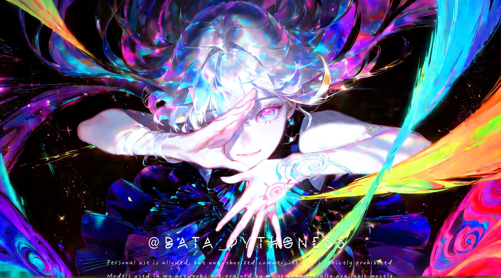

# threads-temp-media

## TL;DR
I created an `n8n` workflow to auto-generate images using a `ChatGPT` prompt and `ComfyUI` (one of `Stable Diffusion`'s famous UIs) that runs on a `RunPod Serverless`, and then posts to Threads and auto refreshing token by `GitHub Action` periodically.

This is a temporary media repository for auto-posting threads.

