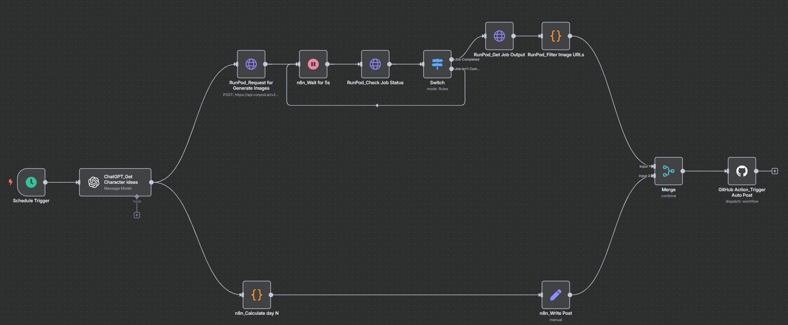

# threads-temp-media

This is a temporary media repository for auto-posting threads.

## TL;DR
I created an n8n workflow, which can auto-generate images using ChatGPT to generate text and corresponding image prompts.
 
Pack an exclusive Stable Diffusion model into a ComfyUI docker image, and also transform it to a RunPod Serverless endpoint. 

Finally, posts these artifacts to Threads and auto-refreshes the token by GitHub Action periodically.

tags: `n8n`, `ChatGPT`, `Docker`, `ComfyUI`, `Stable Diffusion`, `RunPod Serverless`, `GitHub Action`
